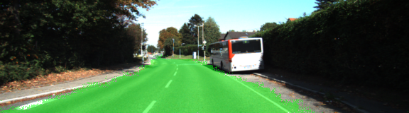
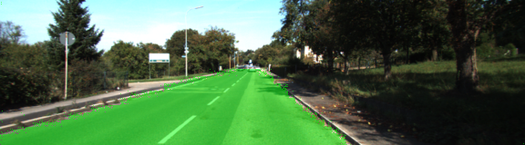
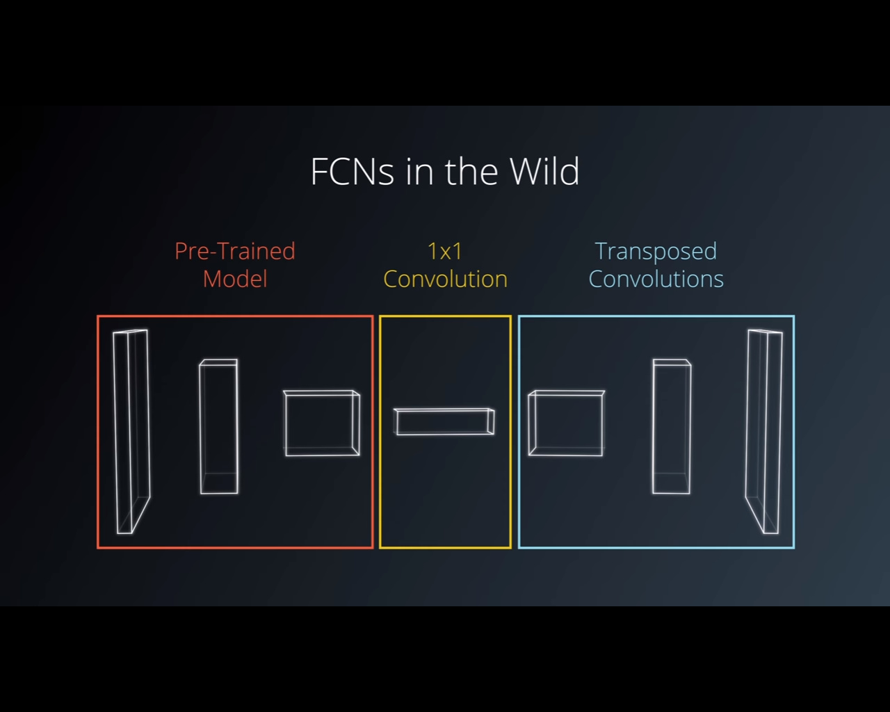
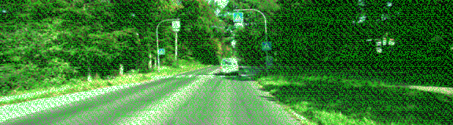

# Self-Driving Car Engineer Nanodegree
# Computer Vision
## Project: Semantic Segmentation applied on road dataset

### Introduction
In this project, I implemented a Fully Convolutional Network (FCN) to label the pixels of a road 

### Results
Here are 2 different images on which the trained FCN has been applied. You can found all the result images in the [runs](https://github.com/Mornor/CarND-Semantic-Segmentation/tree/master/runs/1503860319.698257) folder.  
  * Example 1 

  * Example 2 

### FCN architecture
* Why FCN and not Convolution Network?  
I will first explain why I did not choose a simple Convolutional Network here.  
A Deep Convolutional Network is really good at guessing what an image is, but we loose the spatial information because of the downsampling made by it.   
Here, as we want to detect the road on an image, it is important to keep this spatial dimension. Hence we use a FCN, which will upsample the output result of VGG16 to its initial size.   

A FCN is divided into 3 parts:  
  *1. An Encoder, here a pre-trained VGG16 model
  *2. 1 X 1 Convolution
  *3. Transposed convolution 

### Discussion 
* Choosen parameters (can be tune to yield better results):  
  * `5` Epochs
  * A batch size of `8`
  * A dropout of `.75`
  * `AdamOptimizer` with a learning rate of `.0001` 

* `kernel_initializer`  
I choose [tf.truncated_normal_initializer](https://www.tensorflow.org/api_docs/python/tf/truncated_normal_initializer) as a way to generate a normal distribution. Though some parameters above have been changed between the two following images, using a 
`kernel_initializer` was a game changer. 

Without kernel_initializer                                           |  With kernel_initializer
:-------------------------------------------------------------------:|:-------------------------------------------------------------------:
 | 

Talk about parameters to tune, AWS training and kernel_initializer

### Setup
##### Frameworks and Packages
Make sure you have the following is installed:
 - [Python 3](https://www.python.org/)
 - [TensorFlow](https://www.tensorflow.org/)
 - [NumPy](http://www.numpy.org/)
 - [SciPy](https://www.scipy.org/)
##### Dataset
Download the [Kitti Road dataset](http://www.cvlibs.net/datasets/kitti/eval_road.php) from [here](http://www.cvlibs.net/download.php?file=data_road.zip).  Extract the dataset in the `data` folder.  This will create the folder `data_road` with all the training and test images.

### Credits
All images (except the ones in `runs` folder) are the property of [Udacity](https://www.udacity.com/)